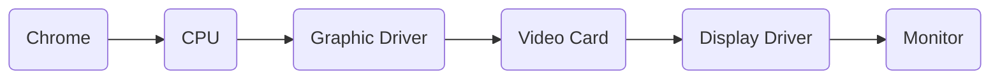

```mermaid
flowchart LR

Chrome(Chrome) --> CPU(CPU)
CPU --> GD(Graphic Driver)
GD --> VD(Video Card)
VD --> DD(Display Driver)
DD --> Monitor(Monitor)
```

Angular app UI fails to refresh when 
1. It fails to initiate change detection;
2. Change detection fails to detect changes (the need to refresh UI).