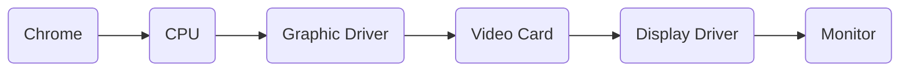

Below is an over-simplified UI rendering flowchart:

Angular app UI fails to refresh UI when: 
1. It fails to initiate change detection;
    - Each component has its own change detection strategy, either 'default' or 'on-push';
    - Change detection is triggered much more frequently under 'default' than under 'on-push';
    - Sometimes values have changed, but Angular is not aware of the change and fails to trigger change detection.
2. Change detection is initiated, but it fails to detect changes.