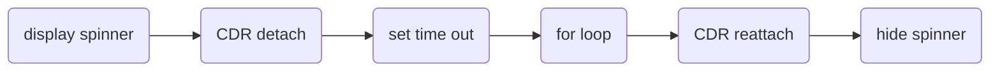

If you have a large amount of UI changes (e.g. server sends lots of new data; instantiating reactive forms in a loop; etc.) coming, you may disable change detection and reenable it after the data changes are complete.



```typescript
constructor(private cdr: ChangeDetectorRef) {}

displaySpinner();
this.cdr.detach();

// we use setTimeout() to ensure displaySpinner() is executed and UI is updated to show the spinner before CPU is hijacked by the for loop.
setTimeout({
    // run your for loop to instantiate 50 reactive forms
    this.cdr.reattach()
    hideSpinner();
});

```