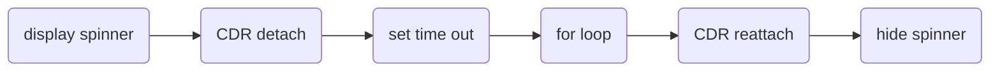

If you have a large amount of UI changes (e.g. server sends lots of new data; instantiating reactive forms in a loop; etc.) coming, you may disable change detection and reenable it after the data changes are complete.



In the example below, we use cdr.detach() and cdr.reattach() to disable change detection temporarily. 
- setTimeout() ensures that displaySpinner() will display a spinner. Without setTimeout(), the spinner wil not be displayed due to for loop hijacking CPU resources;
- cdr.detach() and cdr.reattache() are optional, as UI will not refresh while the for loop is running.

```typescript
constructor(private cdr: ChangeDetectorRef) {}

displaySpinner();

// disable change detection
this.cdr.detach();

// we use setTimeout() to ensure displaySpinner() is executed and UI is updated to show the spinner before CPU is hijacked by the for loop.
setTimeout({
    // run your for loop to instantiate 50 reactive forms
    for (...) {}

    // reenable change detection
    this.cdr.reattach()
    hideSpinner();
});

```