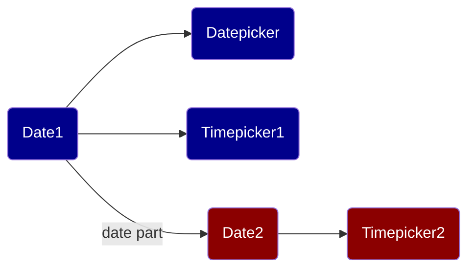

```mermaid
flowchart LR
classDef s1 fill: darkblue, color: white;
classDef s2 fill: darkred, color: white;

Date1(Date1):::s1 --> Datepicker(Datepicker):::s1
Date1 --> Timepicker1(Timepicker1):::s1
Date1 --> |date part| Date2(Date2):::s2
Date2 --> Timepicker2(Timepicker2):::s2

```